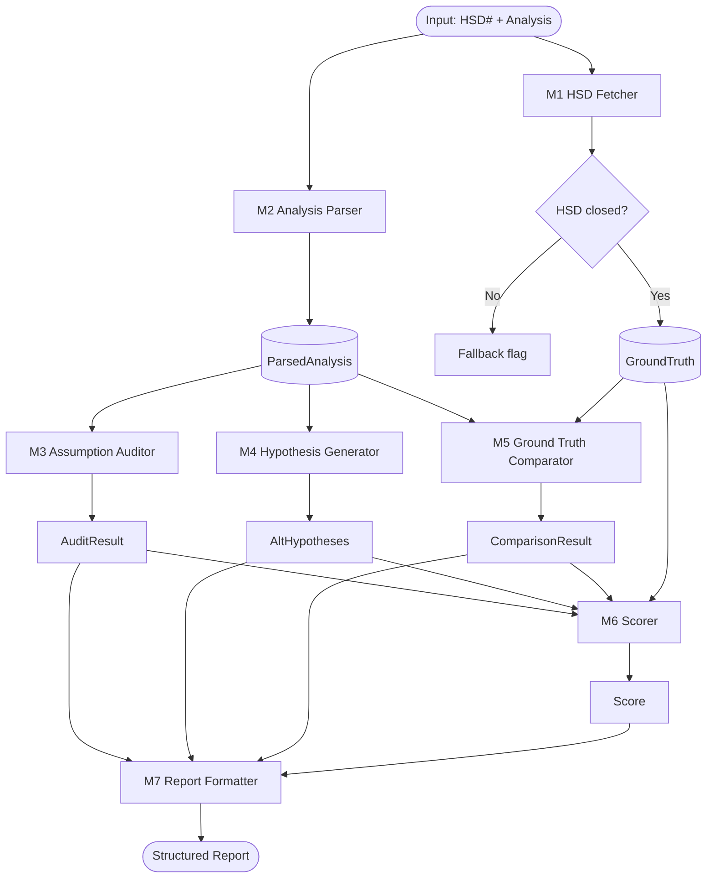
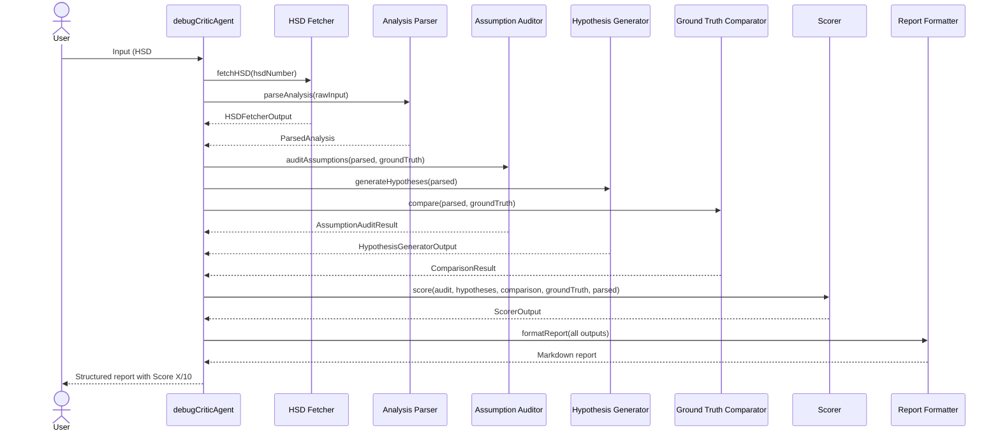

# Detailed Design Document — debugCriticAgent

**Version**: 1.0  
**Date**: 2026-06-08  
**Source Requirement**: `debugCriticAgent.agent.md`

---

## Table of Contents

1. [System Overview](#1-system-overview)
2. [Module Decomposition](#2-module-decomposition)
3. [Module M1 — HSD Fetcher](#3-module-m1--hsd-fetcher)
4. [Module M2 — Analysis Parser](#4-module-m2--analysis-parser)
5. [Module M3 — Assumption Auditor](#5-module-m3--assumption-auditor)
6. [Module M4 — Hypothesis Generator](#6-module-m4--hypothesis-generator)
7. [Module M5 — Ground Truth Comparator](#7-module-m5--ground-truth-comparator)
8. [Module M6 — Scorer](#8-module-m6--scorer)
9. [Module M7 — Report Formatter](#9-module-m7--report-formatter)
10. [Input Interface Design](#10-input-interface-design)
11. [End-to-End Flow](#11-end-to-end-flow)
12. [Error Handling & Boundary Conditions](#12-error-handling--boundary-conditions)
13. [Test Strategy](#13-test-strategy)

---

## 1. System Overview

`debugCriticAgent` is a VS Code Copilot custom agent that:

1. Accepts an HSD ticket number and/or a root cause analysis (RCA) as input.
2. Optionally fetches the closed HSD ticket to extract the verified root cause.
3. Critiques the submitted RCA against the verified root cause or first principles.
4. Produces a structured report with an explicit 1–10 score.

### Input modes

| Mode | Description |
|------|-------------|
| **A — Chat context** | User or another agent pastes the RCA text directly in the chat message |
| **B — JSON file** | A structured JSON file is provided via file path; agent reads and parses it |

Both modes may be combined (e.g. HSD number in chat + JSON file for the RCA body).

### High-level data flow



---

## 2. Module Decomposition

| ID | Module | Responsibility | Depends on |
|----|--------|---------------|------------|
| M1 | HSD Fetcher | Retrieve HSD ticket, extract verified root cause | External MCP tools |
| M2 | Analysis Parser | Parse submitted RCA into structured form | Raw input (chat or JSON) |
| M3 | Assumption Auditor | Classify each assumption as Verified / Unverified / Contradicted | M1 output, M2 output |
| M4 | Hypothesis Generator | Generate alternative hypotheses not in the submitted RCA | M2 output |
| M5 | Ground Truth Comparator | Compare M2 parsed RCA against M1 ground truth | M1 output, M2 output |
| M6 | Scorer | Apply rubric and produce a 1–10 score | M3, M4, M5 outputs |
| M7 | Report Formatter | Render all module outputs into the final Markdown report | All module outputs |

Each module consumes a well-defined input struct and produces a well-defined output struct. They share no mutable state and can be tested independently.

---

## 3. Module M1 — HSD Fetcher

### Responsibility

Retrieve the HSD ticket from the HSDes system and extract structured fields needed for ground-truth comparison.

### Input

```typescript
interface HSDFetcherInput {
  hsdNumber: string | null;  // e.g. "12345678", or null if not provided
}
```

### Output

```typescript
interface HSDFetcherOutput {
  found: boolean;
  status: "closed" | "open" | "not_found";
  ticket: {
    id: string;
    title: string;
    rootCause: string | null;       // null if not recorded
    fixSummary: string | null;
    keyEvidence: string[];          // log snippets, trace references, etc.
    closedDate: string | null;      // ISO date string
  } | null;
  fallbackMode: boolean;            // true when no usable ground truth is available
  error: string | null;
}
```

### Pseudocode

```
function fetchHSD(input: HSDFetcherInput) -> HSDFetcherOutput:
    if input.hsdNumber is null:
        return { found: false, status: "not_found", fallbackMode: true, ... }

    raw = call mcp_mcp_server_get_hsdes_issue_info(hsdNumber)
    if raw is error:
        return { found: false, status: "not_found", fallbackMode: true, error: raw.message }

    summary = call mcp_mcp_server_get_hsdes_issue_summary(hsdNumber)

    ticket = {
        id:          raw.id,
        title:       raw.title,
        rootCause:   extract_root_cause(raw, summary),
        fixSummary:  extract_fix_summary(raw, summary),
        keyEvidence: extract_evidence_list(raw, summary),
        closedDate:  raw.closedDate,
    }

    status = "closed" if raw.status in CLOSED_STATUSES else "open"
    fallbackMode = (status != "closed") or (ticket.rootCause is null)

    return { found: true, status, ticket, fallbackMode }
```

### Error handling

| Condition | Behavior |
|-----------|----------|
| HSD number not provided | `found=false`, `fallbackMode=true`, no error |
| MCP call fails / network error | `found=false`, `status="not_found"`, populate `error` |
| Ticket exists but is open | `status="open"`, `fallbackMode=true` |
| Ticket closed but no root cause field | `fallbackMode=true`, note in report |

---

## 4. Module M2 — Analysis Parser

### Responsibility

Accept raw analysis input (chat text or JSON file) and produce a normalized structured representation of the claimed root cause, reasoning chain, evidence, and proposed fix.

### Input

```typescript
// Mode A: chat text
interface AnalysisParserInputChat {
  mode: "chat";
  rawText: string;
}

// Mode B: JSON file
interface AnalysisParserInputFile {
  mode: "file";
  filePath: string;
}

type AnalysisParserInput = AnalysisParserInputChat | AnalysisParserInputFile;
```

### JSON File Schema (Mode B)

```json
{
  "claimedRootCause": "string — one sentence",
  "mechanism": "string — how the root cause leads to the failure",
  "evidenceCited": ["string", "..."],
  "assumptions": ["string", "..."],
  "proposedFix": "string",
  "reasoning": "string — free-form explanation"
}
```

All fields are optional; the parser fills missing fields with `null` and flags them as `unverified`.

### Output

```typescript
interface ParsedAnalysis {
  claimedRootCause: string | null;
  mechanism: string | null;
  evidenceCited: string[];
  assumptions: string[];         // extracted explicit + implicit assumptions
  proposedFix: string | null;
  reasoning: string | null;
  parseWarnings: string[];       // e.g. "No evidence cited", "Fix not stated"
}
```

### Pseudocode

```
function parseAnalysis(input: AnalysisParserInput) -> ParsedAnalysis:
    if input.mode == "file":
        raw = read_file(input.filePath)
        data = parse_json(raw)
        return map_json_to_ParsedAnalysis(data)

    if input.mode == "chat":
        text = input.rawText
        return {
            claimedRootCause: extract_section(text, ["root cause", "cause", "因为", "原因"]),
            mechanism:        extract_section(text, ["mechanism", "how", "导致"]),
            evidenceCited:    extract_list(text,    ["evidence", "log", "trace", "data"]),
            assumptions:      extract_assumptions(text),   // heuristic + LLM extraction
            proposedFix:      extract_section(text, ["fix", "solution", "修复", "解决"]),
            reasoning:        text,
            parseWarnings:    check_completeness(...)
        }
```

### Error handling

| Condition | Behavior |
|-----------|----------|
| File not found | Raise error, abort pipeline |
| JSON parse error | Raise error with line/column, abort |
| Chat text has no discernible root cause | Set `claimedRootCause=null`, add warning |
| All fields null | Add warning "Analysis appears empty", continue (M6 will score 1–2) |

---

## 5. Module M3 — Assumption Auditor

### Responsibility

For each assumption in the parsed analysis, classify it as **Verified**, **Unverified**, or **Contradicted**, using HSD evidence (if available) or general reasoning.

### Input

```typescript
interface AssumptionAuditorInput {
  assumptions: string[];
  groundTruth: HSDFetcherOutput;         // may be fallbackMode=true
  evidenceCited: string[];
}
```

### Output

```typescript
interface AuditedAssumption {
  text: string;
  classification: "Verified" | "Unverified" | "Contradicted";
  justification: string;
}

interface AssumptionAuditResult {
  audited: AuditedAssumption[];
}
```

### Classification rules

| Rule | Classification |
|------|---------------|
| Assumption matches a fact in `groundTruth.ticket.keyEvidence` | Verified |
| Assumption consistent with `groundTruth.ticket.rootCause` | Verified |
| Assumption contradicts `groundTruth.ticket.rootCause` or `fixSummary` | Contradicted |
| Assumption cannot be verified from any available evidence | Unverified |
| No ground truth available (fallback mode) | All assumptions → Unverified unless self-evidently true |

### Pseudocode

```
function auditAssumptions(input: AssumptionAuditorInput) -> AssumptionAuditResult:
    result = []
    for assumption in input.assumptions:
        if contradicts(assumption, input.groundTruth):
            result.append({ text: assumption, classification: "Contradicted", ... })
        else if supported_by(assumption, input.groundTruth, input.evidenceCited):
            result.append({ text: assumption, classification: "Verified", ... })
        else:
            result.append({ text: assumption, classification: "Unverified", ... })
    return { audited: result }
```

---

## 6. Module M4 — Hypothesis Generator

### Responsibility

Generate at least two alternative root cause hypotheses that the submitted analysis did not consider or rule out.

### Input

```typescript
interface HypothesisGeneratorInput {
  claimedRootCause: string | null;
  mechanism: string | null;
  reasoning: string | null;
  hsdTitle: string | null;       // for domain context
}
```

### Output

```typescript
interface AlternativeHypothesis {
  hypothesis: string;
  reasoning: string;   // why this is plausible and not ruled out
}

interface HypothesisGeneratorOutput {
  alternatives: AlternativeHypothesis[];   // minimum 2
}
```

### Generation strategy

1. Identify the failure symptom from the claimed root cause.
2. Enumerate common alternative causes for that symptom category (hardware, firmware, software, configuration, timing, environment).
3. Filter out any alternatives that are explicitly ruled out in the analysis.
4. Return the top alternatives with reasoning.

### Pseudocode

```
function generateHypotheses(input: HypothesisGeneratorInput) -> HypothesisGeneratorOutput:
    symptom = infer_symptom(input.claimedRootCause, input.reasoning)
    candidates = enumerate_alternatives(symptom)
    ruled_out = extract_ruled_out(input.reasoning)
    alternatives = [c for c in candidates if c not in ruled_out]
    return { alternatives: top_n(alternatives, min=2) }
```

---

## 7. Module M5 — Ground Truth Comparator

### Responsibility

Compare the parsed RCA against the verified HSD resolution. Produce a structured summary of agreements and divergences. Skipped entirely when `fallbackMode=true`.

### Input

```typescript
interface ComparatorInput {
  parsed: ParsedAnalysis;
  groundTruth: HSDFetcherOutput;
}
```

### Output

```typescript
interface ComparisonResult {
  skipped: boolean;               // true when fallbackMode=true
  rootCauseMatch: "exact" | "category" | "partial" | "wrong" | "unknown";
  mechanismMatch: "correct" | "partial" | "wrong" | "unknown";
  fixMatch: "aligned" | "partial" | "misaligned" | "unknown";
  agreements: string[];
  divergences: string[];
}
```

### Match definitions

| Field | exact | category | partial | wrong |
|-------|-------|----------|---------|-------|
| `rootCauseMatch` | Same cause and mechanism | Same failure domain (e.g. both "memory") | Overlapping but not the same | Different failure domain |
| `mechanismMatch` | Correct chain of causation | Partially correct | Vague | Incorrect | 
| `fixMatch` | Fix described matches actual fix | Similar approach | Different approach, same area | Unrelated fix |

### Pseudocode

```
function compare(input: ComparatorInput) -> ComparisonResult:
    if input.groundTruth.fallbackMode:
        return { skipped: true, ... }

    gt = input.groundTruth.ticket
    pa = input.parsed

    rcMatch  = score_root_cause_match(pa.claimedRootCause, gt.rootCause)
    mchMatch = score_mechanism_match(pa.mechanism, gt.rootCause)
    fixMatch = score_fix_match(pa.proposedFix, gt.fixSummary)

    agreements  = collect_agreements(pa, gt)
    divergences = collect_divergences(pa, gt)

    return { skipped: false, rootCauseMatch: rcMatch, mechanismMatch: mchMatch,
             fixMatch: fixMatch, agreements, divergences }
```

---

## 8. Module M6 — Scorer

### Responsibility

Apply the scoring rubric to all upstream results and produce a single integer score (1–10) with a written justification.

### Input

```typescript
interface ScorerInput {
  auditResult:      AssumptionAuditResult;
  hypotheses:       HypothesisGeneratorOutput;
  comparison:       ComparisonResult;
  groundTruth:      HSDFetcherOutput;
  parsed:           ParsedAnalysis;
}
```

### Output

```typescript
interface ScorerOutput {
  score: number;          // 1–10 integer
  justification: string;  // paragraph explaining the score
}
```

### Scoring rubric

```
Base score when HSD ground truth is available:
  rootCauseMatch == "exact"     → base 9
  rootCauseMatch == "category"  → base 7
  rootCauseMatch == "partial"   → base 5
  rootCauseMatch == "wrong"     → base 3
  rootCauseMatch == "unknown"   → base 2

Adjustments (each ±1, capped at [1, 10]):
  +1  mechanismMatch == "correct"
  +1  fixMatch == "aligned"
  +1  zero Contradicted assumptions
  -1  any Contradicted assumptions
  -1  no evidence cited (evidenceCited is empty)
  -1  fixMatch == "misaligned"

Score when fallback mode (no closed HSD):
  Apply first-principles rubric:
    Strong evidence + sound reasoning chain         → 7–8
    Some evidence, plausible reasoning              → 5–6
    No evidence, speculation only                   → 3–4
    No root cause stated                            → 1–2
```

### Pseudocode

```
function score(input: ScorerInput) -> ScorerOutput:
    if not input.groundTruth.fallbackMode:
        base = BASE_SCORE[input.comparison.rootCauseMatch]
        adj  = 0
        adj += 1 if input.comparison.mechanismMatch == "correct"
        adj += 1 if input.comparison.fixMatch == "aligned"
        adj += 1 if no Contradicted in input.auditResult.audited
        adj -= 1 if any Contradicted in input.auditResult.audited
        adj -= 1 if input.parsed.evidenceCited is empty
        adj -= 1 if input.comparison.fixMatch == "misaligned"
        score = clamp(base + adj, 1, 10)
    else:
        score = first_principles_score(input.parsed, input.auditResult)

    justification = build_justification(score, input)
    return { score, justification }
```

---

## 9. Module M7 — Report Formatter

### Responsibility

Assemble all module outputs into the final Markdown report following the prescribed output format.

### Input

```typescript
interface ReportFormatterInput {
  hsdFetcherOutput:   HSDFetcherOutput;
  parsedAnalysis:     ParsedAnalysis;
  auditResult:        AssumptionAuditResult;
  hypotheses:         HypothesisGeneratorOutput;
  comparison:         ComparisonResult;
  scorerOutput:       ScorerOutput;
}
```

### Output

A Markdown string with the following sections (some conditional):

```
### HSD Summary           ← omit if no HSD number was provided
### Analysis Under Review
### Assumption Audit
### Alternative Hypotheses
### Comparison to Ground Truth   ← omit if fallbackMode=true
### Score: X / 10
### Recommended Next Steps
```

### Section rendering rules

| Section | Render condition | Content source |
|---------|-----------------|----------------|
| HSD Summary | `hsdFetcherOutput.found == true` | M1 |
| Analysis Under Review | Always | M2 |
| Assumption Audit | Always | M3 |
| Alternative Hypotheses | Always | M4 |
| Comparison to Ground Truth | `comparison.skipped == false` | M5 |
| Score | Always | M6 |
| Recommended Next Steps | Always | M6 justification + M3 Contradicted items + M5 divergences |

---

## 10. Input Interface Design

Two input modes are supported:

### Mode A — Chat context

The user (or a delegating agent) provides all information in the chat message body. The agent detects the HSD number via regex and treats the remaining text as the RCA.

**Detection pattern for HSD number:**
```
/HSD#?(\d{7,10})/i
```

**Example chat input:**
```
HSD#12345678

Root cause: The firmware misconfigures the PCIe link width during power-on reset.
Mechanism: ...
Fix: Apply microcode patch 0x1A2.
Evidence: Link training log shows 0x04 instead of 0x10 at offset 0x8C.
```

### Mode B — JSON file

The agent reads a JSON file at a provided path. The schema is defined in M2.

**Example JSON file:**
```json
{
  "claimedRootCause": "Firmware misconfigures PCIe link width during power-on reset",
  "mechanism": "BIOS writes 0x04 to width register instead of 0x10",
  "evidenceCited": ["Link training log offset 0x8C", "Platform validation report #44"],
  "assumptions": [
    "The platform was running the latest BIOS",
    "No other firmware agents modify the same register"
  ],
  "proposedFix": "Apply microcode patch 0x1A2 to override register write",
  "reasoning": "..."
}
```

### Combined mode

Both an HSD number (chat) and a JSON file path may be provided simultaneously. The JSON file supplies the structured RCA; the HSD number supplies the ground truth.

---

## 11. End-to-End Flow



---

## 12. Error Handling & Boundary Conditions

| Scenario | Module | Behavior |
|----------|--------|----------|
| No HSD number provided | M1 | `fallbackMode=true`, skip HSD sections in report |
| HSD not found in HSDes | M1 | `status="not_found"`, note in report, `fallbackMode=true` |
| HSD is open (unresolved) | M1 | `status="open"`, note in report, `fallbackMode=true` |
| HSD closed but root cause field is blank | M1 | `fallbackMode=true`, note in report |
| JSON file missing or unreadable | M2 | Abort with error message to user |
| JSON schema validation fails | M2 | Abort with specific field errors |
| Chat text has no parseable RCA | M2 | Warn user, set all fields null, continue |
| Zero assumptions extracted | M3 | Return empty audit list, add note in report |
| `claimedRootCause` is null | M4, M5, M6 | Generate generic hypotheses; comparator marks `rootCauseMatch="unknown"`; scorer uses lower base |
| Both HSD and analysis missing | All | Abort immediately with usage instructions |
| Score would exceed 10 or go below 1 | M6 | Clamp to [1, 10] |

---

## 13. Test Strategy

Each module is independently testable by injecting its input struct directly (no external dependencies required for unit tests). MCP calls in M1 are mocked.

### M1 — HSD Fetcher

| Test case | Input | Expected output |
|-----------|-------|-----------------|
| Valid closed HSD with root cause | `hsdNumber="12345678"` (mock: closed) | `status="closed"`, `fallbackMode=false`, `rootCause` populated |
| Valid open HSD | mock: open | `status="open"`, `fallbackMode=true` |
| HSD not in system | mock: 404 | `found=false`, `status="not_found"` |
| No HSD number provided | `hsdNumber=null` | `found=false`, `fallbackMode=true`, no error |
| Closed HSD with blank root cause | mock: closed, rootCause="" | `fallbackMode=true`, note populated |

### M2 — Analysis Parser

| Test case | Input | Expected output |
|-----------|-------|-----------------|
| Well-formed JSON file | valid JSON | All fields populated, no warnings |
| JSON missing `proposedFix` | JSON without fix field | `proposedFix=null`, warning added |
| Chat text with clear sections | structured text | Fields extracted correctly |
| Chat text with no root cause | vague text | `claimedRootCause=null`, warning |
| Empty JSON `{}` | `{}` | All fields null, warnings for each |
| File not found | bad path | Error thrown, pipeline aborted |

### M3 — Assumption Auditor

| Test case | Input | Expected output |
|-----------|-------|-----------------|
| Assumption matches HSD evidence | assumption ∈ keyEvidence | `Verified` |
| Assumption contradicts root cause | assumption ≠ rootCause | `Contradicted` |
| Assumption not in any evidence | novel assumption | `Unverified` |
| Empty assumption list | `assumptions=[]` | `audited=[]`, no error |
| fallbackMode=true | no ground truth | All → `Unverified` |

### M4 — Hypothesis Generator

| Test case | Input | Expected output |
|-----------|-------|-----------------|
| Standard root cause | concrete claim | ≥ 2 alternatives returned |
| Null root cause | `claimedRootCause=null` | ≥ 2 generic alternatives |
| Reasoning already rules out 5 alternatives | many ruled-out items | Still returns ≥ 2 unremarked alternatives |

### M5 — Ground Truth Comparator

| Test case | Input | Expected output |
|-----------|-------|-----------------|
| Exact match | parsed RC == HSD RC | `rootCauseMatch="exact"` |
| Category match | same domain, different specific cause | `rootCauseMatch="category"` |
| Wrong root cause | different domain | `rootCauseMatch="wrong"` |
| fallbackMode=true | no ground truth | `skipped=true` |

### M6 — Scorer

| Test case | Input | Expected output |
|-----------|-------|-----------------|
| Exact match, good evidence | comparison.rootCauseMatch="exact", evidenceCited non-empty | Score ≥ 9 |
| Wrong root cause, no evidence | "wrong", empty evidence | Score ≤ 3 |
| Contradicted assumption present | any Contradicted | Score adjusted -1 |
| fallbackMode, strong reasoning | fallback=true, good text | Score 7–8 |
| All null fields | empty parsed analysis | Score 1–2 |
| Adjustment overflow | max adjustments | Clamped to 10 |

### M7 — Report Formatter

| Test case | Input | Expected output |
|-----------|-------|-----------------|
| Full data (HSD closed) | all modules populated | All 7 sections present |
| No HSD | `hsdFetcherOutput.found=false` | HSD Summary section absent |
| fallbackMode=true | `comparison.skipped=true` | Comparison section absent |
| Empty audit | `audited=[]` | Assumption Audit section renders "(none extracted)" |
